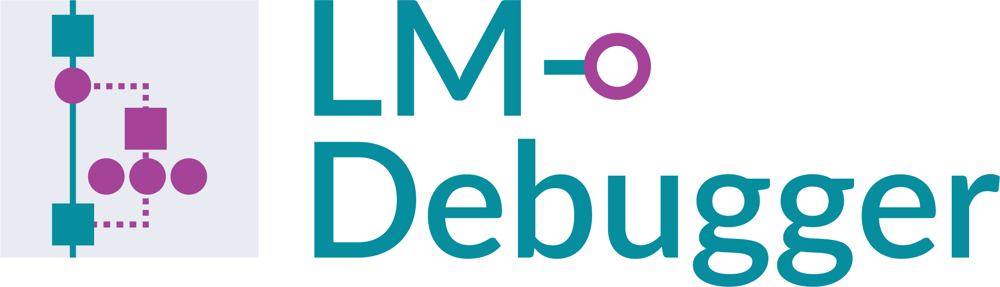
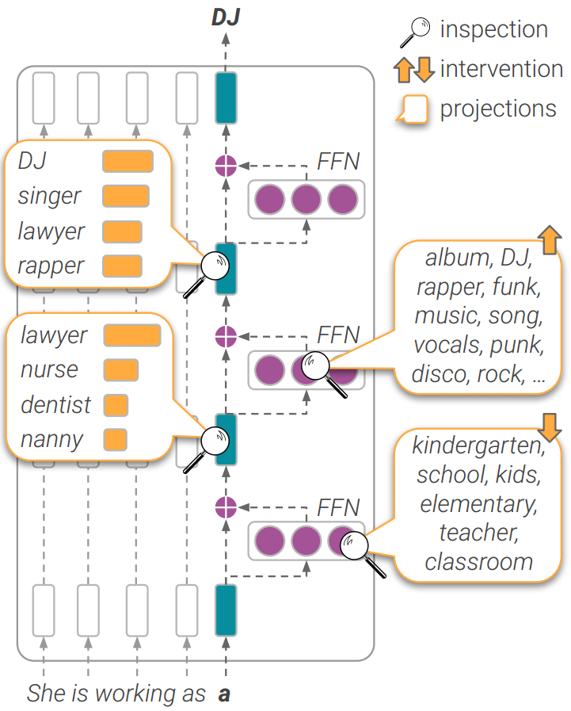

[//]: # (# LM-Debugger 🔎 )
### 


LM-Debugger is an open-source interactive tool for inspection and intervention in transformer-based language models.
This repository includes the code and links for data files required for running LM-Debugger over GPT2 Large and GPT2 Medium. Adapting this tool to other models only requires changing the backend API (see details below). 
Contributions our welcome!


An online demo  of LM-Debugger is available at: 
- GPT2 Medium: https://lm-debugger.apps.allenai.org/
- GPT2 Large: https://lm-debugger-l.apps.allenai.org/


[](http://www.youtube.com/watch?v=5D_GiJv7O-M "LM-Debugger demonstration")


For more details, please check our paper:
"[LM-Debugger: An Interactive Tool for Inspection and Intervention in Transformer-Based Language Models](https://arxiv.org/abs/2204.12130)".

<p align="center"></p>


### ⚙️ Requirements

LM-Debugger has two main views for (a) debugging and intervention in model predictions, and (b) exploration of information encoded in the model's feed-forward layers.

The tool runs in a React and python environment with Flask and Streamlit installed. In addition, the exploration view uses an Elasticsearch index. To set up the environment, please follow the steps below:

1. Clone this repository:
   ```bash
   git clone https://github.com/mega002/lm-debugger
   cd lm-debugger
   ```
2. Create a Python 3.8 environment, and install the following dependencies:
   ```bash
   pip install -r requirements.txt
   ```

4. Install [Yarn](https://yarnpkg.com/) and [NVM](https://github.com/nvm-sh/nvm), and set up the React environment:
   ```bash
   cd ui
   nvm install
   yarn install
   cd ..
   ```

5. Install [Elasticsearch](https://www.elastic.co/guide/en/elasticsearch/reference/current/install-elasticsearch.html) and make sure that the service is up.


### 🔎 Running LM-Debugger

#### Creating a Configuration File 
LM-Debugger executes one model at a time, based on a given configuration file. The configuration includes IP addresses and port numbers for running the different services, as well as the following fields:
- `model_name`: The current version of LM-Debugger supports GPT2 models from [HuggingFace](https://huggingface.co/transformers) (e.g. `gpt2-medium` or `gpt2-large`).
- `server_files_dir`: A path to store files with preprocessed model information, created by the script [create_offline_files.py](flask_server/create_offline_files.py). The script creates 3 pickle files with (1) projections to the vocabulary of parameter vectors of the model's feed-forward layers, (2) two separate files with mappings between parameter vectors and clusters (and vice versa).   
- `create_cluster_files`: A boolean field (`true`/`false`) that indicates whether to run clustering or not. This is optional since clustering of the feed-forward parameter vectors can take several hours and might require extra computation resources (especially for large models).    

Sample configuration files for the medium and large versions of GPT2 are provided in the [config_files](config_files) directory.
The preprocessed data files for these models are available for download [here](https://console.cloud.google.com/storage/browser/ai2i/ffn_debugger).

#### Creating an Elasticsearch Index
The keyword search functionality in the exploration view is powered by an Elasticsearch index that stores the projections of feed-forward parameter vectors from the entire network. To create this index, run:
```bash
python es_index/index_value_projections_docs.py \
--config_path CONFIG_PATH
```


#### Executing LM-Debugger

To run LM-Debugger:
```bash
bash start.sh CONFIG_PATH
```

------------------------------
In case you are interested in _running only one of the two views of LM-Debugger_, this can be done as follows:

1. To run the Flask server (needed for the prediction view):
   ```bash
   python flask_server/app.py --config_path CONFIG_PATH
   ```

2. To run the prediction view:
   ```bash
   python ui/src/convert2runConfig.py --config_path CONFIG_PATH
   cd ui
   yarn start
   ```

3. To run the exploration view:
   ```bash
   streamlit run streamlit/exploration.py -- --config_path CONFIG_PATH
   ```


### Citation
Please cite as:
```bibtex
@article{geva2022lmdebugger,
  title={LM-Debugger: An Interactive Tool for Inspection and Intervention in Transformer-Based Language Models},
  author={Geva, Mor and Caciularu, Avi and Dar, Guy and Roit, Paul and Sadde, Shoval and Shlain, Micah and Tamir, Bar and Goldberg, Yoav},
  journal={arXiv preprint arXiv:2204.12130},
  year={2022}
}
```
